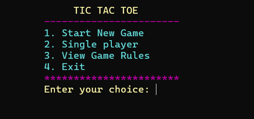
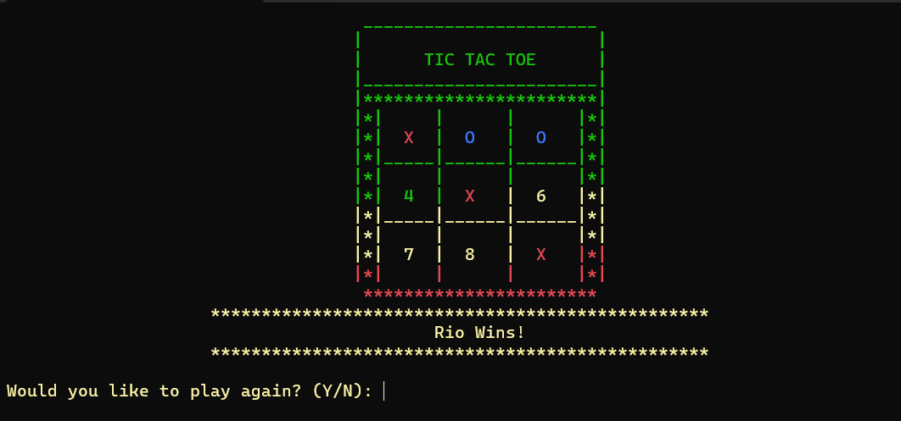

# 🎮 Tic Tac Toe Game in C++

A simple terminal-based **Tic Tac Toe** game built using C++. This project was collaboratively developed as part of our coursework to enhance programming fundamentals and GitHub collaboration skills.

##     📷 Sample outputs

<p align="center">
  
  
</p>

---

## 📌 Project Overview

This game enables two players to play Tic Tac Toe in a terminal environment. It features a color-enhanced UI, turn-based logic, and endgame detection (win, draw).

---

## 📁 Features

- ✅ Two-player mode with symbol selection
- 🧠 AI for single-player mode (More like a tough oponent)
- 🎨 Colorful console display using ANSI codes
- ❌ Invalid move detection and handling
- 🔁 Game replay and reset option
- 🧽 Cross-platform console clearing (Windows/Linux/macOS)

##    📷 Sample output AI moves

 

---

## 🧠 How It Works

1. Players take turns choosing a cell number (1–9).
2. The game checks for a win or draw after every move.
3. If a win or draw occurs, the game displays the result and offers a replay option.
4. It handels errors correctly like displaying error message when player violates rules
---

## 🚀 Getting Started

### 🛠️ Requirements

- A C++ compiler (e.g., `g++`)
- Terminal or command line interface
- IDE mostly codeblock but you can use any IDE you want 
### 📦 Compile & Run

```bash
g++ -o tictactoe tictactoe.cpp
./tictactoe
````

---

## 👥 Team Collaboration Guidelines

This project is subject to academic collaboration policy:

* ✅ All members must **contribute via GitHub** to receive credit.
* ⛔ **Copying or plagiarism** will result in automatic rejection.
* 🕒 Late submissions will not be accepted.
* 📧 Instructor must be added as a **collaborator**: `yitulema@gmail.com`

---

## 📂 Project Structure

```
📁 TicTacToe/
├── tictactoe.cpp        # Main source code
├── README.md            # Project documentation
└── images/
    ├── banner1.png       # Header image
    ├── banner2.png 
    └── banner3.png   # Gameplay with AI snapshot
```

---

## 📜 License

This repository is for educational use only. Redistribution or reuse without proper attribution or permission will be subject to disciplinary action.

---

## 🙌 Credits

**Developed by Group 1 — Arbaminch University 2016 Batch Software Students**
*Department of Software Engineering*

### 👨‍💻 Contributors

* Misiker Genene (NSR/1450/16)
* Biruk Getahun (NSR/----/16)
* Tsion Samuel (NSR/----/16)
* Heran Mohammed (NSR/----/16)
* Hilina Kitachew (NSR/----/16)
* Sadam Robel (NSR/----/16)

---

## 🧑‍🏫 Instructor Note

Dear Instructor,
We have respected all collaboration and academic integrity policies. You have been added as a GitHub collaborator using the provided email address. Each member's contributions are visible in the commit history and project activity logs.

Built With Love❤️
---
